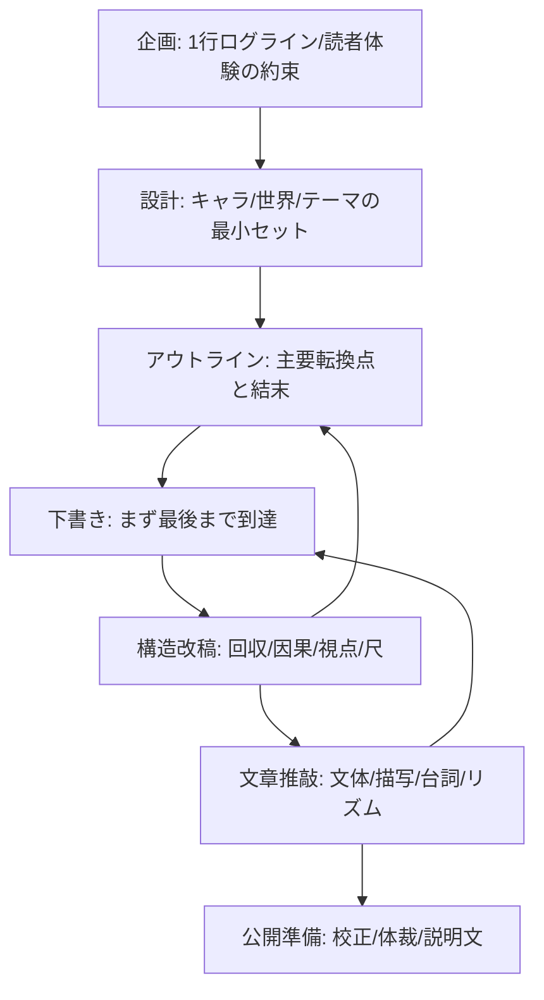

# 制作フロー（creation flow）

> **source**: 2026-04-09 taiji 提供のフロー図
> **role**: craft methodology の 7 ステップを Story OS の reverse flow と並記したもの。`CLAUDE.md` の「制作フロー」節と対応する。

## 基本の前進フロー（7 step）

1. **企画** — 1行ログライン／読者体験の約束
2. **設計** — キャラ／世界／テーマの最小セット
3. **アウトライン** — 主要転換点と結末
4. **下書き** — まず最後まで到達
5. **構造改稿** — 回収／因果／視点／尺
6. **文章推敲** — 文体／描写／台詞／リズム
7. **公開準備** — 校正／体裁／説明文

## 逆流（reverse flow）

原典の図では次の2本の逆流が明示されている。Story OS の `Reverse Flow` 節と整合する。

- 構造改稿 → アウトライン（因果や回収が壊れていたら arc / packet 設計に戻る）
- 文章推敲 → 下書き（文体や描写で粗が出たら draft を書き直す）

## mermaid

## Story OS 成果物との対応

| 7 step | Story OS での主な成果物 | 典型的な reverse flow 先 |
|---|---|---|
| 企画 | `story/seeds/`, `story/promises.md` | — |
| 設計 | `bible/characters.md`, `bible/world.md`, `bible/rules.md` | `story/promises.md` |
| アウトライン | `arcs/series-overview.md`, `arcs/arc-01.md`, `packets/` | `bible/`, `story/promises.md` |
| 下書き | `scenes/`, `drafts/` | `packets/`, `bible/characters.md` |
| 構造改稿 | `reviews/`（typed review）, `story/canon-patch-proposals/`, `story/design-debt.yaml` | `arcs/`, `packets/`, `story/promises.md` |
| 文章推敲 | `drafts/`（文体パス）, `reviews/` | `scenes/`, `drafts/` |
| 公開準備 | `approved/`, `published/` | `story/open-questions.md`（残す謎） |

## 備考

- 原典フローの「構造改稿」と「文章推敲」を1工程で済ませないこと。原典の教訓に従い、最低でも別工程として分けて運用する。
- reverse flow は「感想で終わらせない」ための仕組み。`CLAUDE.md` の制作優先順位 4 と対応する。
